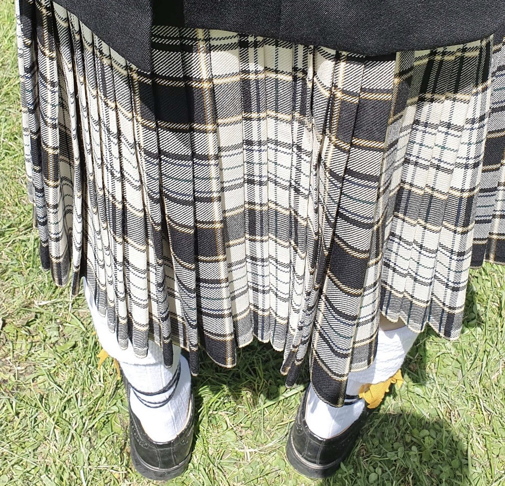
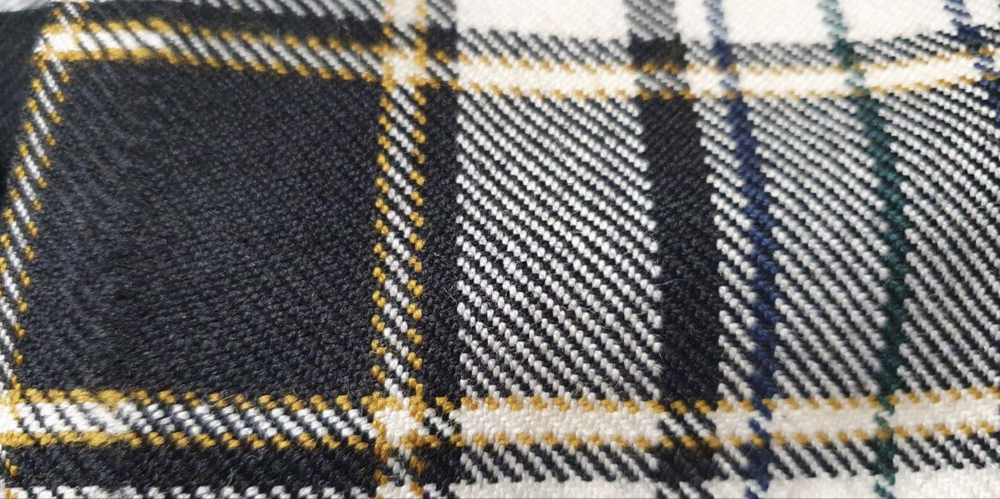
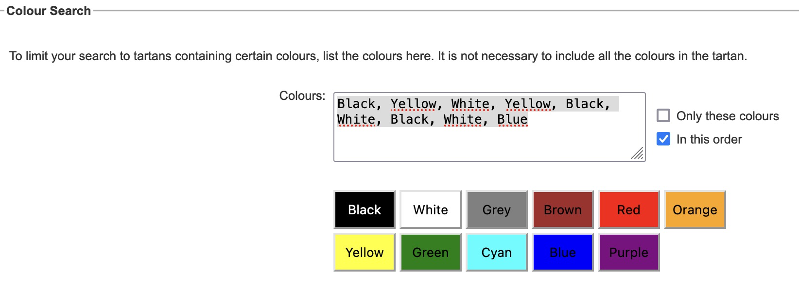
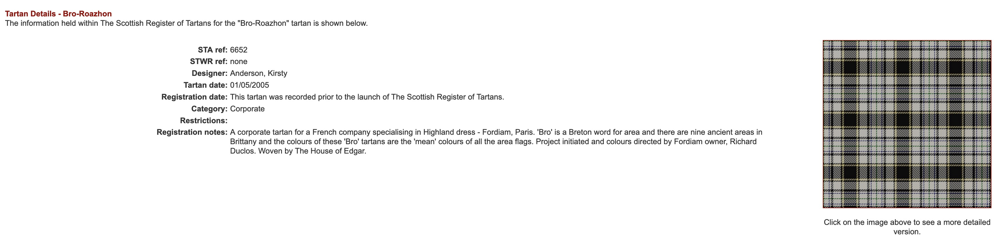

# TARTAN INTELLIGENCE
**How to identify a tartan with its color**

Tartans are highly codified, and registered on [the Scottish Register of Tartans](https://www.tartanregister.gov.uk)

The main difficulties is to get the horizontal color order to search the database.

We want to find this tartan : 

With only this image, it quite hard because of the ripples, we could try to guess but it would be hard.

Fortunatly, we got a second image where the tartan is flattened : 

Now, we can define the order of the colors : 
`Black, Yellow, White, Yellow, Black, White, Black, White, Blue`

The Scottish register offers a [search engine](https://www.tartanregister.gov.uk/search) where you can enter your colors. Don't forget to tick the "in this order" checkbox !

And, as each tartan is unique, if your color scheme is long enough, you will have only one result !

You are now a specialist in Tartan Intelligence !
