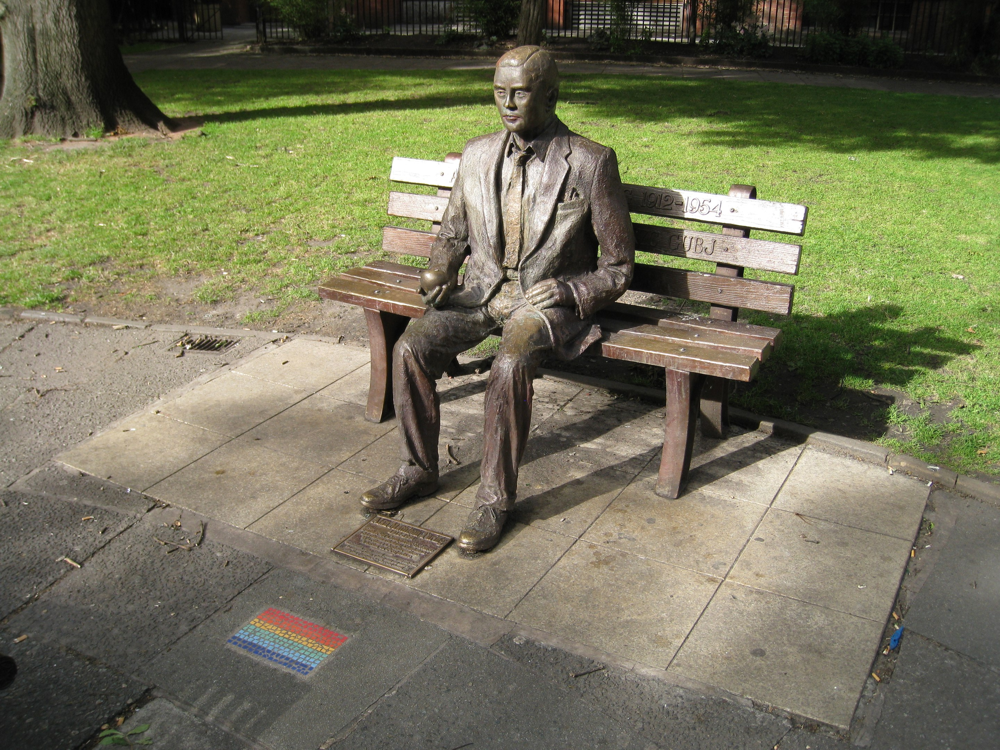

## Instructions
We have this message : 
`TBYPXYGBSIZJQPQKMEFTFDSPXGMYREBZQSDROCZQCGFJQMIWWINDPNUOFQIRCRFDNVUCIMRGWOGQOIGGBZWZVLIOGWZKSWXANKNOKJJKAKDERIFBELLSTQLIIUGSZLMPKLMFEWTTUWUR`

And an image :

## Resolve this one

With an easy google reverse image search, we find that this is Turing memorial.
Alan Turing broke enigma code !

### Decoding

We go to our best friend dcode.fr by example, and submit the message to the enigma machine.
We got this (with added spaces): 
`CONVERT TO UNIX TIMESTAMP THE DATE OF BIRTH AT MIDNIGHT PAST ONE MINUTE AND THE DATE OF DEATH AT MIDNIGHT PAST TWO MINUTES OF THE SUBJECT. ADD THE TWO DATES AND FIND THE FLAG

- date of birth of alan turing is 23/06/1912
  At midnight past one minutes , the timestamp was : -1815350340
- He died on the 07/06/1954
  At midnight past 2 minutes, the timestamp was : -491360280

	We add the two numbers : -2306710620

## What to do ?
We look at the file with steghide, and find that the result is a passphrase to extract `flag.txt`
The flag is : `flag{turingWasHere}`

Well done !